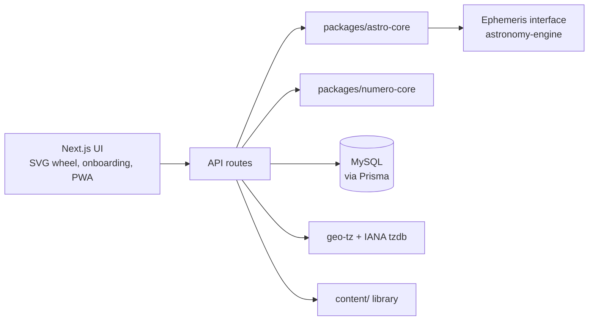

# AstralSync — Architecture

Technical design for v1 (local-first), derived from `AstralSync_PRD_v2.md` (v2.0). Task tracking lives in `TODO.md`.

## 1. Overview

AstralSync is a **single Next.js monolith** (App Router). UI, API routes, and all calculation logic run in one process. Natal chart computation is a few milliseconds of arithmetic — there is no computational load justifying separate services, so there are no microservices, no gateway, and no external runtime. One `npm run dev` (or one Docker container) starts everything, and everything runs offline at $0 cost.



## 2. Repository layout

```
AstralSync/
├── app/                    # Next.js App Router: pages + API routes
├── components/             # React components (chart wheel, onboarding, profile UI)
├── packages/
│   ├── astro-core/         # Chart calculation — framework-free TypeScript
│   └── numero-core/        # Numerology calculation — framework-free TypeScript
├── content/                # Versioned interpretation library (Markdown/JSON)
├── prisma/                 # Schema + migrations
├── scripts/                # One-off tooling (GeoNames import)
└── docker-compose.yml      # Optional: app + MySQL
```

## 3. Module boundaries

- **`packages/astro-core`** and **`packages/numero-core`** contain all math. They are standalone TypeScript packages with **no Next.js or database imports** — pure functions from input contract to output JSON. This keeps them testable in isolation and portable (e.g., to client-side execution in Phase 3).
- **Ephemeris interface:** `astro-core` talks to a thin internal interface, implemented by `astronomy-engine` (MIT, pure JS, no data files, ~1 arcminute accuracy). A `swisseph` (AGPL) implementation can be swapped in later without touching anything else. Not built in v1.
- **API routes** are the only layer that touches the database and orchestrates: resolve location/timezone → call core packages → persist snapshot → attach content.
- **UI** renders exclusively from stored snapshot JSON — it never triggers recalculation.

### astro-core contract (the keystone interface — PRD §10)

- **Input:** UTC instant, latitude/longitude, house system (`placidus | whole_sign | equal`), time certainty (`exact | approx | unknown`)
- **Output:** snapshot JSON — per-planet `{ longitude, sign, house, retrograde }`, aspect list `{ pair, type, orb }`, house cusps, Ascendant/MC (nullable), engine name + version, and suppression/uncertainty flags
- Unknown time → **solar chart**: signs and aspects only; Ascendant, houses, and Moon degree precision suppressed with machine-readable reasons
- High latitude where Placidus degenerates → automatic Whole Sign fallback, recorded in the output

## 4. Data flow: compute once, read forever

1. Onboarding collects birth date, optional time, city (offline search), and shows the resolved UTC offset for confirmation/override.
2. On save, the server computes the astro and numero snapshots **exactly once** and stores them.
3. Every subsequent view renders from the stored JSON. **Zero recomputation** — the performance strategy is caching, not optimization (target < 200ms end-to-end for the one-time calculation).
4. **Immutability rule:** snapshots are write-once. Editing birth data (or changing house system) creates a *new* snapshot version; old versions are preserved.

## 5. Data model (MySQL, PRD §6)

Five tables; access pattern is "fetch profile and its snapshots by ID" — standard PK/FK indexing only.

- **`profile`** — display name, optional full birth name + script (`latin|hebrew|other`), birth date, nullable birth time, time certainty, city FK, lat/lng, IANA tz, UTC offset minutes, `offset_overridden`
- **`geo_city`** — imported once from GeoNames `cities15000` (~30k cities: name, ascii_name, country, admin1, lat/lng, population)
- **`astro_snapshot`** *(write-once)* — version, house system, `is_solar_chart`, Big Three columns, `placements_json`, `aspects_json`, engine + engine_version + content_version
- **`numero_snapshot`** *(write-once)* — version, system (`pythagorean|gematria`), life path / destiny / soul urge, `is_master_lp`, `derivation_json` (letter-by-letter)
- **`reading`** — optional synthesis, generated once per snapshot pair; `generator` (`template|llm`), nullable model name

ORM: **Prisma** (first-class MySQL support; schema-as-migrations keeps a clean path to hosted MySQL/Postgres in Phase 3).

## 6. Geolocation & timezone pipeline (fully offline)

```
city name → geo_city LIKE/prefix query → lat/lng
lat/lng   → geo-tz → IANA timezone
IANA tz + birth moment → historical UTC offset (incl. DST)
```

No external APIs, no rate limits, no cost. **Known limitation surfaced in UI:** historical tz data before ~1970 is imperfect in every available database, so onboarding always displays the resolved offset and allows manual override (persisted as `offset_overridden`).

## 7. Interpretation content strategy

The math is solved; the text is the product (PRD §5). Content is a first-class, versioned deliverable:

- **Format:** Markdown/JSON files in `content/`, keyed by placement (`planet_in_sign`, `planet_in_house`, `aspect`, `ascendant_sign`, `element_dominance`, `modality_dominance`, `life_path`, `destiny`, `soul_urge`).
- **Versioning:** snapshots record the `content_version` that rendered them.
- **v1 scope:** ~40 entries — Big Three + Life Path + element dominance. The schema supports the full matrix from day one; entries fill in incrementally.
- **Sourcing:** original authored text (informed by public-domain literature, never copied).
- **Optional LLM synthesis:** one combined reading per snapshot, generated once and stored in `reading` (Ollama locally, or an API by choice). **Off by default** — the app is fully functional without it.

## 8. Key decisions (ADR-lite)

| Decision | Choice | Over | Why |
| --- | --- | --- | --- |
| Architecture | Next.js monolith | Microservices (v1.0 PRD) | Calculation is milliseconds of math; one process, one command to run |
| Ephemeris | astronomy-engine (MIT) | Swiss Ephemeris (AGPL) | No data files, no native build, ~1′ accuracy — 10× better than astrology needs; swap path kept open |
| Geocoding | GeoNames in MySQL + geo-tz | Google Maps / Mapbox | Offline, free, no rate limits |
| Database | MySQL | PostgreSQL | Already installed locally; migrations keep the exit path open |
| ORM | Prisma | Drizzle | Both fine per PRD; Prisma chosen for maturity + migration tooling |
| Mobile | PWA | React Native | Native doubles work for zero v1 value |
| Calculation site | Server-side (API route) | Client-side | Single source of truth for v1; pure-JS engine keeps client-side open for Phase 3 static hosting |
| Performance | Immutable write-once snapshots | Recompute + optimize | Compute once, read forever; editing creates a new version |

## 9. Testing strategy (PRD §8)

- **Golden chart tests** in `astro-core`: 10–15 reference charts with known published placements, asserting sign, house, and longitude within 1 arcminute of Swiss Ephemeris reference values.
- **Required edge cases:** birth near midnight across a DST transition; high-latitude birth (Placidus → Whole Sign fallback); planet stationing (retrograde flag); sign-cusp Moon with approximate time; pre-1970 offset warning.
- **Numerology:** master numbers 11/22/33 preservation; Y-as-vowel rules documented and tested; Hebrew final letter forms in gematria.
- Core packages are framework-free, so all of the above runs as plain unit tests with no server or database.

## 10. Non-goals & phase gates

**Out of scope for v1 (deliberate cuts, PRD §7):** React Native, user accounts/auth, cloud hosting/CDN, synastry, transits, minor aspects/asteroids/fixed stars/progressions, UI localization (content structure must not preclude it).

**Phase 2:** synastry overlay, daily transits dashboard (the only feature requiring ongoing computation), full interpretation matrix.

**Phase 3 (public deployment gate):** authentication, hosted database, privacy hardening (encryption at rest, retention, GDPR-style deletion), rate limiting, client-side calculation re-evaluation. Privacy section §4.6 of the PRD must be revisited before any public deployment — exact birth data is near-identifying personal data; v1 stores it only on the local machine, names are optional, and every profile supports full JSON export and hard delete.
